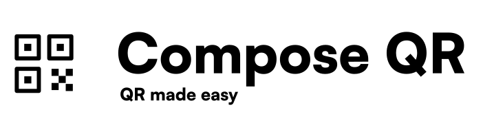

<p align="start">
  <a href="https://central.sonatype.com/artifact/run.nabla/qr"></a>
  <a href="https://github.com/nabla-run/Compose-QR"></a>
  <a href="https://developer.android.com/about/versions/nougat/android-7.0"></a>
  <a href="https://github.com/nabla-run/Compose-QR/blob/main/LICENSE"></a>
</p>
## Setup

Library is available on `mavenCentral()`.

```kotlin
repositories {
  mavenCentral()
}
```

```kotlin
implementation("run.nabla:qr:1.0.0")
```

## Screenshots


## Functions

## Contributing

Contributions to Compose-QR are welcome! If you find any issues or have suggestions for
improvements, please create an issue or submit a pull request.

## License

    Copyright 2023 Nable Contributors

    Licensed under the Apache License, Version 2.0 (the "License");
    you may not use this file except in compliance with the License.
    You may obtain a copy of the License at

       https://www.apache.org/licenses/LICENSE-2.0

    Unless required by applicable law or agreed to in writing, software
    distributed under the License is distributed on an "AS IS" BASIS,
    WITHOUT WARRANTIES OR CONDITIONS OF ANY KIND, either express or implied.
    See the License for the specific language governing permissions and
    limitations under the License.